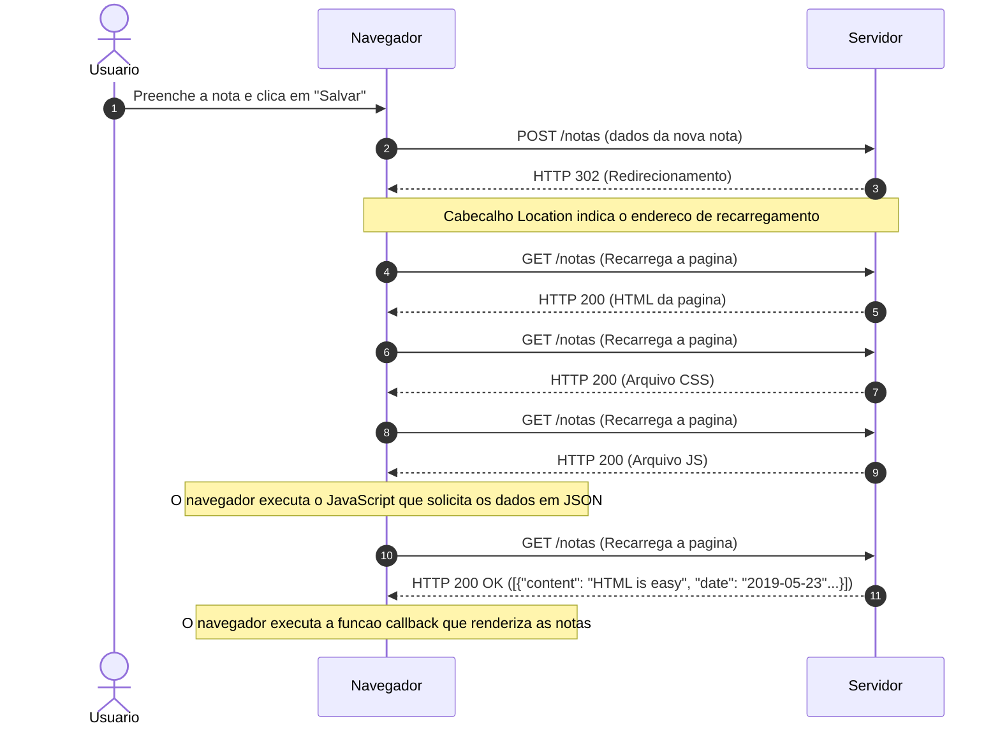

```mermaid
sequenceDiagram
    autonumber
    actor U as Usuario  
    participant N as Navegador
    participant S as Servidor


    U->>N: Preenche a nota e clica em "Salvar"
    N->>S: POST /notas (dados da nova nota)
    S-->>N: HTTP 302 (Redirecionamento)
    Note over N,S: Cabecalho Location indica o endereco de recarregamento

    N->>S: GET /notas (Recarrega a pagina)
    S-->>N: HTTP 200 (HTML da pagina)

    N->>S: GET /notas (Recarrega a pagina)
    S-->>N: HTTP 200 (Arquivo CSS)

    N->>S: GET /notas (Recarrega a pagina)
    S-->>N: HTTP 200 (Arquivo JS)

    Note over N: O navegador executa o JavaScript que solicita os dados em JSON

    N->>S: GET /notas (Recarrega a pagina)
    S-->>N: HTTP 200 OK ([{"content": "HTML is easy", "date": "2019-05-23"...}])

    Note over N: O navegador executa a funcao callback que renderiza as notas

```