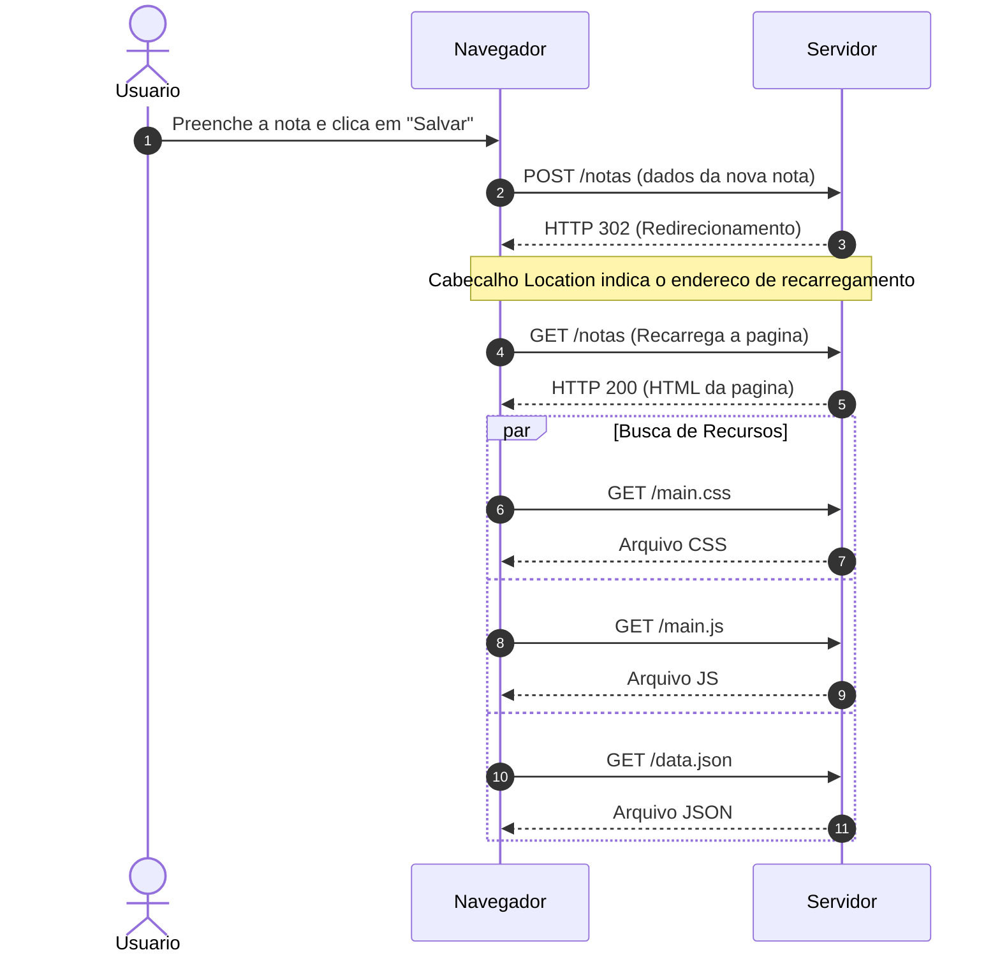

```mermaid
sequenceDiagram
    autonumber
    actor U as Usuario  
    participant N as Navegador
    participant S as Servidor


    U->>N: Preenche a nota e clica em "Salvar"
    N->>S: POST /notas (dados da nova nota)
    S-->>N: HTTP 302 (Redirecionamento)
    Note over N,S: Cabecalho Location indica o endereco de recarregamento

    N->>S: GET /notas (Recarrega a pagina)
    S-->>N: HTTP 200 (HTML da pagina)


    par Busca de Recursos
        N->>S: GET /main.css
        S-->>N: Arquivo CSS
    and
        N->>S: GET /main.js
        S-->>N: Arquivo JS
    and
        N->>S: GET /data.json
        S-->>N: Arquivo JSON
    end
```