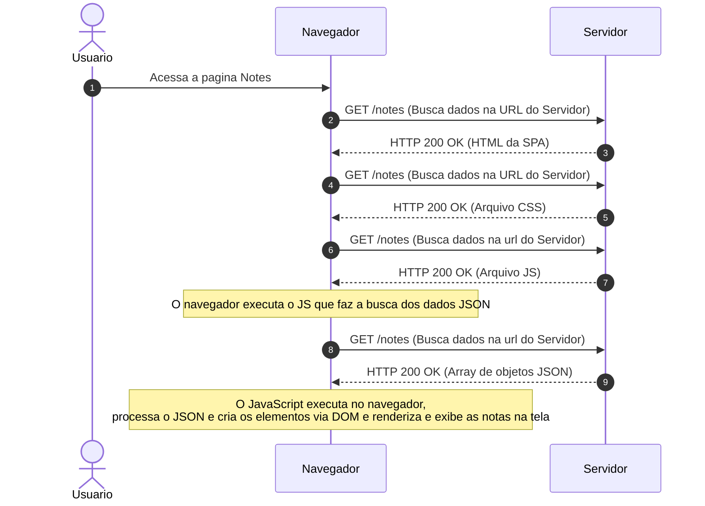

```mermaid
sequenceDiagram
    autonumber
    actor U as Usuario
    participant N as Navegador
    participant S as Servidor

    U->>N: Acessa a pagina Notes
    N->>S: GET /notes (Busca dados na URL do Servidor)
    S-->>N: HTTP 200 OK (HTML da SPA)


    N->>S: GET /notes (Busca dados na URL do Servidor)
    S-->>N: HTTP 200 OK (Arquivo CSS)

    N->>S: GET /notes (Busca dados na url do Servidor)
    S-->>N: HTTP 200 OK (Arquivo JS)

    Note over N: O navegador executa o JS que faz a busca dos dados JSON

    N->>S: GET /notes (Busca dados na url do Servidor)
    S-->>N: HTTP 200 OK (Array de objetos JSON)

    Note over N: O JavaScript executa no navegador, <br/>processa o JSON e cria os elementos via DOM e renderiza e exibe as notas na tela
```