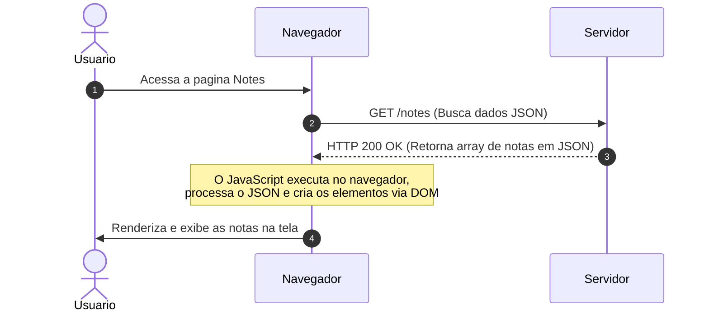

```mermaid
sequenceDiagram
    autonumber
    actor U as Usuario
    participant N as Navegador
    participant S as Servidor

    U->>N: Acessa a pagina Notes
    N->>S: GET /notes (Busca dados JSON)
    S-->>N: HTTP 200 OK (Retorna array de notas em JSON)

    Note over N: O JavaScript executa no navegador, <br/>processa o JSON e cria os elementos via DOM
    N->>U: Renderiza e exibe as notas na tela
```